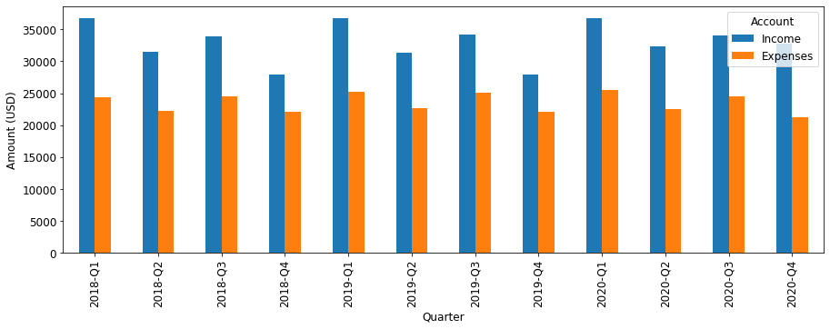
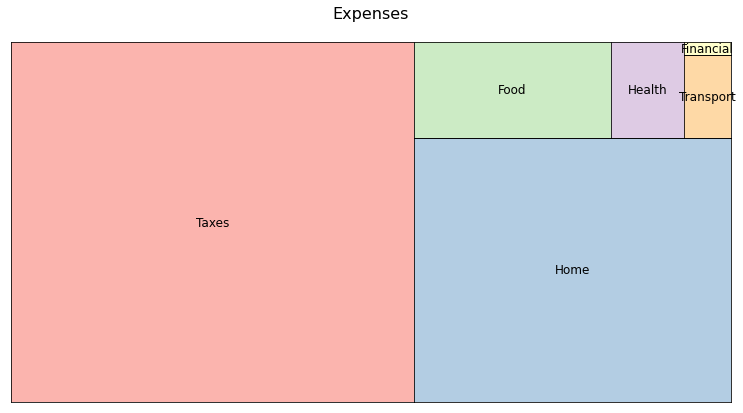

# Multiperiod Reports by Month/Quarter/Year in Beancount
If you've ever used [hledger](https://hledger.org/), you might like its ability to produce nice reports. One of the reports' feature is the table structure, where rows are accounts and columns are weeks, months, quarters or years. Looking at earnings and spendings as a function of time can give you more insights about your finances.

However, if you are using [beancount](http://furius.ca/beancount/), this feature is not yet supported in the command line interface. You need to use [fava](https://github.com/beancount/fava), an awesome web-interface for beancount, which has a graph drawing capability as described in this tutorial. fava is not ideal and sometimes you might need more custom reports than the ones available in fava.

This notebook provides methodology and tools to:
- Process BQL query's output using Pandas library
- Generate yearly totals (multiperiod reports by year) by pivoting a table
- Aggregate values at different account levels for the provided account hierarchy
- Draw treemap plots of expenses for all time period

Details are in [this blog post](https://www.isabekov.pro/multiperiod-hledger-style-reports-in-beancount-pivoting-a-table/).

## Installation and Running

	$ git clone https://github.com/isabekov/beancount-multiperiod-reports
    $ sudo pip install -r requirements.txt
	$ jupyter lab beancount-multiperiod-reports
    
For example, "quarter" version of the notebook (__Beancount_Multiperiod_Reports_by_Quarter.ipynb__) will do the following operations on an example file:

### Executing a BQL Query


```python
cols, rows = run_query(entries, opts, 
                       "SELECT   account,   YEAR(date) AS year,\
                                 MONTH(date) as month,\
                                 SUM(convert(position, '{}', date)) AS amount\
                        WHERE    account ~ 'Expenses'\
                        OR       account ~ 'Income'\
                        GROUP BY account, year, month\
                        ORDER BY account, year, month".format(currency)
                      )
```


### Converting Result Rows to a Pandas Dataframe
|    | Account                        | YearMonth   |   Amount (USD) |
|---:|:-------------------------------|:------------|---------------:|
|  0 | Expenses:Financial:Commissions | 2018-10     |          44.75 |
|  1 | Expenses:Financial:Commissions | 2018-11     |          35.8  |
|  2 | Expenses:Financial:Commissions | 2018-12     |          35.8  |
|  3 | Expenses:Financial:Commissions | 2019-05     |          35.8  |
|  4 | Expenses:Financial:Commissions | 2019-06     |           8.95 |


### Pivoting a Table by a Time Interval (e.g. Quarter)
|    |            Account             |   2018-Q1 |   2018-Q2 |   2018-Q3 |   2018-Q4 |   2019-Q1 |   2019-Q2 |   2019-Q3 |   2019-Q4 |   2020-Q1 |   2020-Q2 |   2020-Q3 |   2020-Q4 |
|---:|:-------------------------------|----------:|----------:|----------:|----------:|----------:|----------:|----------:|----------:|----------:|----------:|----------:|----------:|
|  0 | Expenses:Financial:Commissions |      0    |      0    |      0    |    116.35 |      0    |     44.75 |     71.6  |      8.95 |      0    |     98.45 |     62.65 |     71.6  |
|  1 | Expenses:Financial:Fees        |     12    |     12    |     12    |     12    |     12    |     12    |     12    |     12    |     12    |     12    |     12    |     12    |
|  2 | Expenses:Food:Coffee           |      0    |      5.49 |      0    |      0    |      0    |      0    |     36.76 |      0    |      0    |      0    |     43.07 |      0    |
|  3 | Expenses:Food:Groceries        |    582.97 |    559.27 |    616.3  |    540.3  |    480.78 |    722.67 |    520.4  |    641.2  |    711.49 |    581.02 |    442.03 |    557.04 |
|  4 | Expenses:Food:Restaurant       |    948.18 |    948.24 |   1139.92 |   1027.88 |    983.15 |   1127.47 |   1780.95 |   1064.27 |   1109.25 |   1143.04 |   1214.8  |    933.98 |


### Creating Multi-Level Accounts
|    | Account_L0   | Account_L1   | Account_L2   | Account_L3   | Account_L4   | Account_L5   |   2018-Q1 |   2018-Q2 |   2018-Q3 |   2018-Q4 |   2019-Q1 |   2019-Q2 |   2019-Q3 |   2019-Q4 |   2020-Q1 |   2020-Q2 |   2020-Q3 |   2020-Q4 |
|---:|:-------------|:-------------|:-------------|:-------------|:-------------|:-------------|----------:|----------:|----------:|----------:|----------:|----------:|----------:|----------:|----------:|----------:|----------:|----------:|
|  0 | Expenses     | Financial    | Commissions  |              |              |              |      0    |      0    |      0    |    116.35 |      0    |     44.75 |     71.6  |      8.95 |      0    |     98.45 |     62.65 |     71.6  |
|  1 | Expenses     | Financial    | Fees         |              |              |              |     12    |     12    |     12    |     12    |     12    |     12    |     12    |     12    |     12    |     12    |     12    |     12    |
|  2 | Expenses     | Food         | Coffee       |              |              |              |      0    |      5.49 |      0    |      0    |      0    |      0    |     36.76 |      0    |      0    |      0    |     43.07 |      0    |
|  3 | Expenses     | Food         | Groceries    |              |              |              |    582.97 |    559.27 |    616.3  |    540.3  |    480.78 |    722.67 |    520.4  |    641.2  |    711.49 |    581.02 |    442.03 |    557.04 |
|  4 | Expenses     | Food         | Restaurant   |              |              |              |    948.18 |    948.24 |   1139.92 |   1027.88 |    983.15 |   1127.47 |   1780.95 |   1064.27 |   1109.25 |   1143.04 |   1214.8  |    933.98 |
     

### Aggregation at Different Account Levels
At level 1:

|    | Account_L0   | Account_L1   |   2018-Q1 |   2018-Q2 |   2018-Q3 |   2018-Q4 |   2019-Q1 |   2019-Q2 |   2019-Q3 |   2019-Q4 |   2020-Q1 |   2020-Q2 |   2020-Q3 |   2020-Q4 |
|---:|:-------------|:-------------|----------:|----------:|----------:|----------:|----------:|----------:|----------:|----------:|----------:|----------:|----------:|----------:|
|  0 | Expenses     | Financial    |     12    |     12    |     12    |    128.35 |     12    |     56.75 |     83.6  |     20.95 |     12    |    110.45 |     74.65 |     83.6  |
|  1 | Expenses     | Food         |   1531.15 |   1513    |   1756.22 |   1568.18 |   1463.93 |   1850.14 |   2338.11 |   1705.47 |   1820.74 |   1724.06 |   1699.9  |   1491.02 |
|  2 | Expenses     | Health       |    678.3  |    581.4  |    678.3  |    581.4  |    678.3  |    581.4  |    678.3  |    581.4  |    678.3  |    581.4  |    678.3  |    678.3  |
|  3 | Expenses     | Home         |   7803.2  |   7810.58 |   7790.05 |   7806.36 |   7798.26 |   7821.55 |   7820.87 |   7828.41 |   7819.9  |   7819.41 |   7820.04 |   5234.56 |
|  4 | Expenses     | Taxes        |  13945.4  |  11953.2  |  13945.4  |  11633.2  |  14854.4  |  11953.2  |  13945.4  |  11633.2  |  14882.1  |  11953.2  |  13945.4  |  13343.9  |

At level 0:

|    | Account_L0   |   2018-Q1 |   2018-Q2 |   2018-Q3 |   2018-Q4 |   2019-Q1 |   2019-Q2 |   2019-Q3 |   2019-Q4 |   2020-Q1 |   2020-Q2 |   2020-Q3 |   2020-Q4 |
|---:|:-------------|----------:|----------:|----------:|----------:|----------:|----------:|----------:|----------:|----------:|----------:|----------:|----------:|
|  0 | Expenses     |   24330   |   22230.2 |   24542   |   22077.5 |   25166.9 |   22623   |   25106.3 |   22129.4 |   25573.1 |   22548.5 |   24578.3 |   21191.3 |
|  1 | Income       |  -36677.9 |  -31438.2 |  -33927.9 |  -27956   |  -36728.8 |  -31368.2 |  -34178.4 |  -27953.5 |  -36793.2 |  -32343.2 |  -34095.5 |  -32699   |


### Income and Expenses over Time



### Treemap Plot of Expenses


